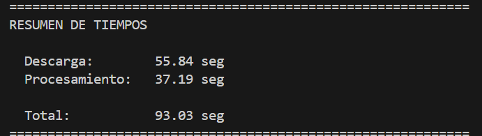
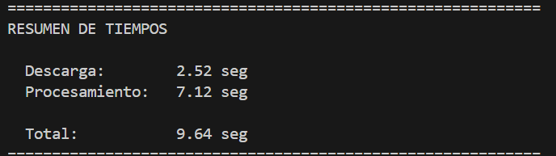

# Proyecto-Paralelismo-Concurrencia

## Descripción del proyecto

Este proyecto tiene como objetivo **descargar y procesar las imágenes HD de los primeros 150 Pokémon** de un repositorio público.  
El pipeline se divide en **dos fases principales**:  

1. **Descarga de imágenes (I/O-bound)**  
2. **Procesamiento de imágenes (CPU-bound)**  

Cada imagen se maneja de forma **individual**, respetando el requerimiento de no procesar lotes como una sola imagen gigante.  
El enfoque principal fue **optimizar el rendimiento** utilizando **concurrencia y paralelismo**, reduciendo drásticamente el tiempo total de ejecución.

---

## 🧩 Tecnologías utilizadas

- **requests** → Descarga de imágenes desde la web  
- **Pillow (PIL)** → Procesamiento de imágenes  
- **tqdm** → Barra de progreso  
- **concurrent.futures** → Concurrencia y paralelismo (`ThreadPoolExecutor` y `ProcessPoolExecutor`)  

---

## ⚙️ Arquitectura del pipeline

- **pokemon.py**
  - **Fase 1: Descarga (I/O-bound)**
    - `download_pokemon_concurrent()`
      - Usa `ThreadPoolExecutor` → Descarga concurrente de múltiples imágenes
  - **Fase 2: Procesamiento (CPU-bound)**
    - `process_pokemon_parallel()`
      - Usa `ProcessPoolExecutor` → Procesamiento paralelo de imágenes
  - **Resumen de tiempos**
  - **Resultados guardados**
    - `pokemon_dataset/` ← Imágenes originales
    - `pokemon_processed/` ← Imágenes procesadas

## 🔍 División de fases

### 1️⃣ Descarga de imágenes (I/O-bound)

- Operación intensiva en **espera de red**.  
- Implementada con **concurrencia** usando `ThreadPoolExecutor`.  
- Cada hilo descarga **una imagen individual**.  
- Ventaja: mientras un hilo espera la descarga de la imagen, otros hilos pueden descargar simultáneamente.  

---

### 2️⃣ Procesamiento de imágenes (CPU-bound)

- Operación intensiva en **cálculo y manipulación de píxeles**.  
- Implementada con **paralelismo** usando `ProcessPoolExecutor`.  
- Cada proceso aplica filtros y transformaciones (Gauss, inversión de color, resizing, contraste, realce de bordes) a **una imagen individual**.  
- Ventaja: cada núcleo de CPU trabaja en paralelo, reduciendo significativamente el tiempo de procesamiento total.

---

## 🧠 Problema y solución

**Problema inicial:**  
- Script secuencial que descargaba y procesaba las imágenes **una por una**, causando tiempos de ejecución muy largos

**Solución implementada:**  
- **Descarga concurrente** con ThreadPoolExecutor para I/O-bound.  
- **Procesamiento paralelo** con ProcessPoolExecutor para CPU-bound.  
- Mantener la manipulación **individual de cada imagen**.  
- Medición de tiempos para comparar el rendimiento y documentar mejoras.

---

## 📊 Resultados

### Tiempos antes de la optimización (baseline)

### Tiempos después de la optimización

✅ La optimización redujo el tiempo total de **93.03s a 9.64s**, aproximadamente **9.3× más rápido**.

---

### Comparativa de tiempos: Baseline vs Solución Paralela/Concurrente

| Fase           | Baseline (s) | Optimizado (s) | Mejora aproximada |
|----------------|--------------|----------------|-----------------|
| Descarga       | 55.84        | 2.52           | ~22× más rápido |
| Procesamiento  | 37.19        | 7.12           | ~5.2× más rápido |
| **Total**      | 93.03        | 9.64           | ~9.7× más rápido |

## 🚀 Estrategias de optimización aplicadas

1. **Descarga concurrente (I/O-bound)**  
   - Uso de `ThreadPoolExecutor` con múltiples hilos.  
   - Cada hilo descarga una imagen individual, maximizando el uso de la red.  

2. **Procesamiento paralelo (CPU-bound)**  
   - Uso de `ProcessPoolExecutor` limitado a 8 procesos (cores físicos).  
   - Cada proceso aplica todas las transformaciones a una imagen individual.  

3. **Medición de tiempos**  
   - Se midieron tiempos individuales de cada fase y el total para mostrar el impacto de la optimización.  

4. **Manejo de errores**  
   - Captura de excepciones durante descarga y procesamiento para evitar interrupciones.  

5. **Mantenimiento del flujo individual**  
   - Cada imagen se descarga y procesa de manera independiente para cumplir los requerimientos del proyecto.

---
